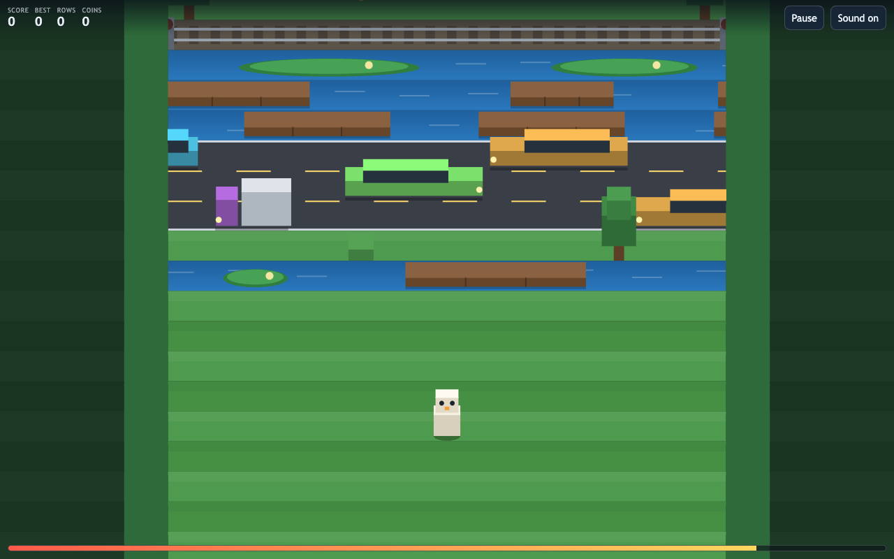
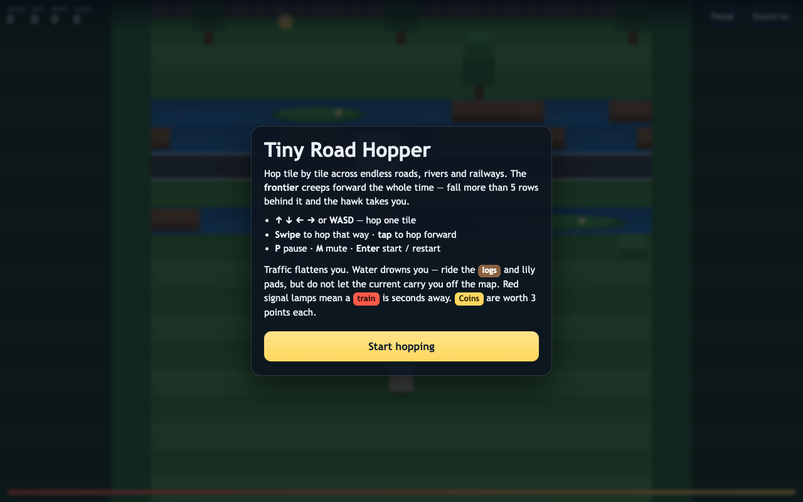
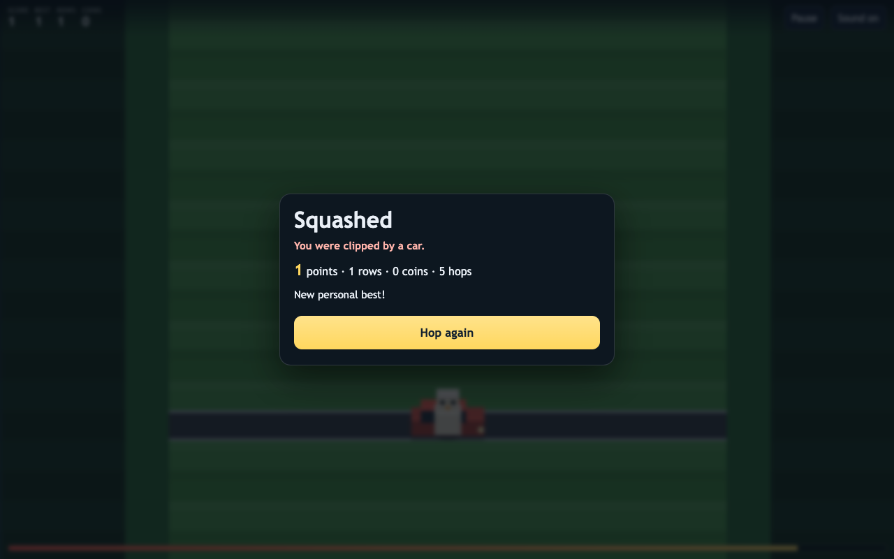
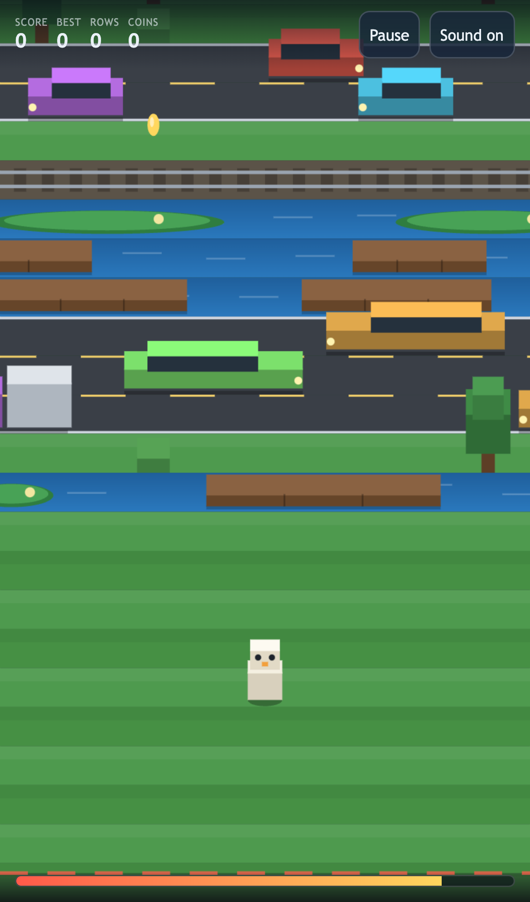

# Tiny Road Hopper

An original grid-hopping arcade game for the browser. You hop one tile at a time
across an endless procession of roads, rivers and railways while the **frontier**
creeps up behind you — stop moving and a hawk takes you.

Desktop and mobile, no install, no required backend, no accounts. TypeScript +
Vite + Canvas 2D, roughly 25 kB of JavaScript.



| Start screen | Game over | Mobile |
| --- | --- | --- |
|  |  |  |

## Gameplay

The board is a 13-column strip that generates forward forever. Each row is one
of four kinds, and each kills you differently:

- **Grass** — safe ground, scattered with trees, rocks and bushes you cannot hop
  into. The generator never leaves three blockers side by side, so a route
  always exists. Some grass rows carry a **coin** worth 3 points.
- **Road** — cars and trucks stream left or right at lane-specific speeds.
  Overlap one and the run ends. Headlights mark the leading end of each vehicle
  so you can read the direction at a glance; faster lanes are generated with
  proportionally larger gaps.
- **River** — open water drowns you. You have to land on a drifting **log** or
  **lily pad**, and while you stand on one it *carries you sideways*. Ride it too
  far and the current sweeps you off the map, so a river row is a timing puzzle
  in two directions at once.
- **Railway** — a track with signal lamps. The lamps blink and a horn sounds
  ~1.45 s before an express crosses the entire row at 26 tiles/second. Standing
  on the rail when it arrives is fatal; the warning is a real grace period, long
  enough to hop clear.

**The frontier** is the pressure. It advances on its own at a rate that grows
with your distance (0.5 → 2.3 rows/second) and is never allowed to trail more
than 5 rows behind your record. Drop behind it and the hawk ends the run. The
gauge along the bottom of the screen is your remaining slack; it throbs red when
you are nearly caught.

**Score** is the number of rows crossed, plus 3 per coin. Your best is kept in
`localStorage`; when the Arcade platform serves the game it also goes to a
leaderboard and to cloud save (see [Arcade platform](#arcade-platform)).

## Controls

| Action | Keyboard | Touch / pointer |
| --- | --- | --- |
| Hop forward | <kbd>↑</kbd> / <kbd>W</kbd> / <kbd>Space</kbd> | tap, or swipe up |
| Hop back | <kbd>↓</kbd> / <kbd>S</kbd> | swipe down |
| Hop left / right | <kbd>←</kbd> <kbd>→</kbd> / <kbd>A</kbd> <kbd>D</kbd> | swipe left / right |
| Pause / resume | <kbd>P</kbd> or <kbd>Esc</kbd> | Pause button |
| Mute | <kbd>M</kbd> | Sound button |
| Start / restart | <kbd>Enter</kbd> | the big button |

A hop takes 130 ms. Pressing a direction mid-hop buffers exactly one move, so
fast chains feel responsive without letting you bank a queue. Hopping into a
tree or the field edge plays a bump and costs you nothing but time. The game
auto-pauses when the tab is hidden.

## Install, dev, build

Requires Node 18+.

```bash
npm ci            # install exactly what package-lock.json pins
npm run dev       # vite dev server on http://localhost:5173
npm run build     # tsc --noEmit && vite build  -> dist/
npm run preview   # serve the production build on :4173
npm test          # vitest: simulation unit tests
npm run smoke     # Playwright: drives dist/ in Chromium, writes docs/ screenshots
npm run smoke:arcade  # Playwright: same bundle, but served by a live Arcade platform
```

`npm run smoke` needs a Chromium binary: `npx playwright install chromium` once.

## Architecture

```
src/game/logic.ts    the entire simulation - pure, deterministic, no DOM, no clock
src/game/render.ts   Canvas 2D renderer (oblique 2.5D)
src/game/game.ts     glue: fixed-timestep loop, DOM HUD, overlay, events
src/game/input.ts    keyboard + swipe/tap
src/game/audio.ts    WebAudio synthesis - no audio files at all
src/game/storage.ts  best score + mute flag in localStorage
src/game/config.ts   every tunable number
src/game/arcade.ts   typed, error-swallowing wrapper around the Arcade platform
public/              platform SDK + bridge, copied verbatim into dist/ by Vite
tests/logic.test.ts  26 unit tests driving logic.ts exactly as the browser does
tests/arcade.test.ts  7 unit tests pinning the platform fallback contract
scripts/smoke.mjs    62 browser checks at desktop + iPhone 13 viewports
scripts/arcade-smoke.mjs  9 browser checks against a running platform
```

Three decisions shaped the rest:

**The simulation is a pure module.** `logic.ts` imports nothing but its own
config, touches no DOM and reads no clock — `step(state, dt)` is the only way
time passes. `game.ts` drives it at a fixed 1/120 s timestep and the unit tests
drive it with the same `dt`, so a test reproduces the browser exactly and physics
is frame-rate independent.

**Traffic is periodic, not spawned.** Each road/river row lays its vehicles down
once inside a repeating world period (`LANE_PERIOD = 26` tiles) and then owns a
single scalar `phase`. A mover's live position is `wrap(p + phase)`. One number
per row animates a whole lane, the streams are infinite with zero allocation,
and there is no spawner to desynchronise from the collision code.

**The camera lives in the renderer.** `frontier` is simulation state, but the
smoothed follow, the sideways pan (only engaged when the field is wider than the
screen) and the tile size are all render-side, so the physics never depends on
the viewport. On a phone the view zooms in and pans with the hopper; on a desktop
the whole 13-column field fits and the camera stays centred.

Everything on screen is a "chunky box" — a front face plus a lighter top face,
drawn far-row-first so nearer traffic overlaps what is behind it. That reads as
depth without a 3D pipeline.

## Verification

Run on macOS 15 (Apple M1), Node 20, from a **clean checkout** extracted with
`git archive HEAD | tar -x` so nothing untracked could contribute:

```
$ npm ci
added 48 packages, and audited 49 packages in 1s

$ npm run build
tsc --noEmit && vite build
dist/index.html                  2.07 kB │ gzip: 0.92 kB
dist/assets/index-*.css          3.25 kB │ gzip: 1.36 kB
dist/assets/index-*.js          25.15 kB │ gzip: 9.66 kB
✓ built in 104ms

$ npm test
✓ tests/arcade.test.ts (7 tests) 4ms
✓ tests/logic.test.ts (26 tests) 63ms
Test Files  2 passed (2)
     Tests  33 passed (33)

$ npm run smoke
62/62 checks passed

$ npm run smoke:arcade          # needs a platform serving /g/tiny-road-hopper/
9/9 cổng pass
```

`dist/` also carries `vendor/arcade.js` (8.3 kB) and `arcade-bridge.js` (3.2 kB),
which Vite copies from `public/` untouched.

The unit tests cover stream wrapping and reversal, generator invariants over 25
seeds (safe opening rows, no sealed grass row, every river row crossable, all
four row kinds appear, rows recycled without leaking), hop mechanics (one tile
per press, mid-hop row commitment, blocked hops, the one-move buffer, input
ignored outside `playing`), every death (car width-accurate hit box, truck,
drowning, swept off the map, the train state machine, the hawk), log riding and
dismounting, scoring including the coin bonus and no double-collect, pause
freezing the world, full state reset, seed determinism, and a 6000-tick
unattended run.

The smoke test asserts against live simulation state rather than pixels, at
1280×800 and iPhone 13: canvas fills the viewport, the board really contains
roads/rivers/rails with moving traffic, frames advance, the canvas is non-empty,
all four hop directions, hop arc, tree blocking, every death path, HUD mirroring
the simulation, the danger gauge going critical, `localStorage` best score,
pause/resume freezing the frontier, mute persistence, real `touchstart`/
`touchmove` swipes and taps on the mobile pass, and zero console/page errors.

Three real bugs these tests caught, for the record: row phase had to accumulate
*signed* (`dir * speed * dt`) — multiplying by `dir` at read time mirrored the
whole stream whenever a row reversed; the grass anti-wall rule had to run on the
*sorted* column list, since blockers are generated in random order; and the
renderer's near/far row bounds were swapped, which made the board stop partway
up the screen and end in bare sky.

## Source reference

Inspired by **Crossy Road** (Hipster Whale) —
<https://apps.apple.com/us/app/crossy-road/id924373886> — used only as a genre
reference for the hop-across-traffic idea. No code, art, audio, branding,
character, level or text from that game is present here. All code, the
`tiny-road-hopper` name, the hopper character and every visual in this repo are
original to this project.

## Asset credits and licence

There are no third-party assets. Every graphic is drawn procedurally with Canvas
2D at runtime and every sound is synthesised with WebAudio oscillators, so the
repo ships no image or audio files and there is nothing to attribute. Fonts are
whatever the OS provides (`Trebuchet MS` / `Avenir Next` / `system-ui`).

Code and content: MIT, see [LICENSE](LICENSE).

## Known limitations

- **Not a difficulty-tuned product.** The pacing curve is hand-picked and only
  lightly playtested; the frontier speed and lane gaps would need real player
  data to balance properly.
- **No accessibility pass beyond the basics.** The HUD has ARIA labels and every
  touch control has a keyboard equivalent, but there is no colour-blind palette,
  no remappable keys and no reduced-motion mode. The danger gauge and the death
  vignette both animate unconditionally.
- **Canvas only.** The board is not a DOM tree, so a screen reader gets the HUD
  and the overlays but not the state of the board.
- **Score is local unless the platform is there.** Standalone, the best score is
  per-browser `localStorage`, and private-browsing failures are swallowed so the
  score becomes session-only. Leaderboards and cross-device save exist only when
  the Arcade platform serves the game.
- **The leaderboard is unverified.** Scores are submitted by the client from a
  browser the player controls, so the boards say what a client claimed, not what
  a referee observed. `mode = "offline"` in `arcade.toml` states this openly.
- **Hop resolution is discrete.** You commit to a destination tile at the apex of
  the hop, so a car that arrives during the second half of a hop kills you even
  though you look mid-air. This is deliberate and tested, but it is a design
  choice rather than a physical simulation.
- **Two open npm advisories, both devDependency-only** and not reachable from the
  built `dist/`: Vite 5.x's esbuild dev-server request rule, and the Playwright
  <1.55 downloader. Both need major bumps of dev tooling, so they are documented
  here rather than forced.
- Verified in Chromium (desktop + emulated iPhone 13). Not tested on real iOS
  Safari, Firefox or Android hardware.

## Arcade platform

The game is playable as a plain static bundle with no server at all. When it is
served by the Arcade platform it additionally gets a leaderboard and cloud save.

- `arcade.toml` declares the manifest: `mode = "offline"`, boards `daily` and
  `alltime`, `client_dir = "dist"` (this is a Vite build, so the static files are
  in `dist/`, not the repo root).
- `public/vendor/arcade.js` is the platform SDK, `public/arcade-bridge.js` the
  shim that exposes `window.ArcadeGame`, and `src/game/arcade.ts` the typed
  wrapper the game calls.
- The bridge only activates when the page is actually served by the platform
  (path `/g/<id>/`, or an explicit `window.ARCADE_BASE_URL`). Anywhere else it
  issues no requests at all, so a standalone deploy stays silent instead of
  logging 404s for an API that is not there.
- A finished run submits the score of *that run* to both boards, and the personal
  best to cloud save. A best arriving from another device is accepted only when
  it is higher than the local one, then written straight back to `localStorage`.
- Every platform call swallows its own errors. If the platform is down the game
  behaves exactly as it did before this integration.

Tests:

```
npm test            # unit, includes the bridge fallback contract
npm run smoke       # browser, platform deliberately absent
npm run smoke:arcade [baseUrl]   # browser, against a running platform
```

`smoke:arcade` proves the parts the other two cannot: guest auth against the real
API, a finished run reaching both boards and reading back, and the personal best
returning from cloud save after the local copy is deleted.
